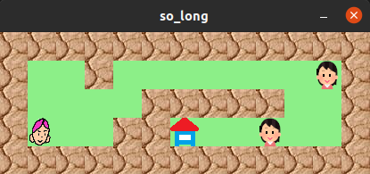

# SO_LONG

このプロジェクトは42プロジェクトの一環です。<br>

簡易的な2Dゲームを作成します。<br>
プレーヤが物を回収して脱出します！<br>

## 学生各位へ注意
このコードをそのまま提出しないでください！<br>
ほんの少しだけバグがあります(ToT)<br>

## コンパイルと実行

実行例<br>

```shell
> make
> ./so_long map/map.ber
```

このような感じで動作します。<br>



### コマンドライン引数

コンパイルしたら、以下のように第１引数にマップファイルを与えてください。<br>

```
> ./so_long <マップファイル>
```

### マップファイルについて

マップファイルは`map/`以下に格納されています。<br>
エラーがあるマップは`err_*.map`です。<br>
マップファイルは以下のフォーマットで構成されます。<br>

> 1 壁<br>
0   空白・プレーヤーが移動可能な場所<br>
P   プレーヤーの初期リスポーン地<br>
E   出口<br>
C   回収する物<br>

また、マップファイルは以下のルールに沿う必要があります。<br>

> ・四角形であること<br>
・四角形は1で囲われていること<br>
・マップ中に少なくとも1つのP、E、Cがあること<br>

例として以下にマップファイルを抜粋します。<br>

`map.ber`

```
1111111111111
10010000000C1
1000011111001
1P0011E00C001
1111111111111
```

### キャラクターの操作

キャラクターはキーボードで動かすことができます。<br>
`WASD`と`矢印キー`をサポートしてます。<br>

> W ↑  上方向に移動<br>
A ←    左方向に移動<br>
S ↓    下方向に移動<br>
D →    右方向に移動<br>

### STDOUT

標準出力にはカウントされた歩数などのデバッグ情報が出力されます。<br>

> Move count : 1<br>
Move count : 2<br>
Move count : 3<br>
Move count : 4<br>
 There is a wall.<br>
 The player can't move right!<br>
Move count : 5<br>
Move count : 6<br>
Move count : 7<br>
Move count : 8<br>
Move count : 9<br>
Move count : 10<br>
Move count : 11<br>
Move count : 12<br>
Move count : 13<br>
Move count : 14<br>
 There is a wall.<br>
 The player can't move down!<br>
Move count : 15<br>
Move count : 16<br>
Move count : 17<br>
Move count : 18<br>
 The game is closed!<br>

